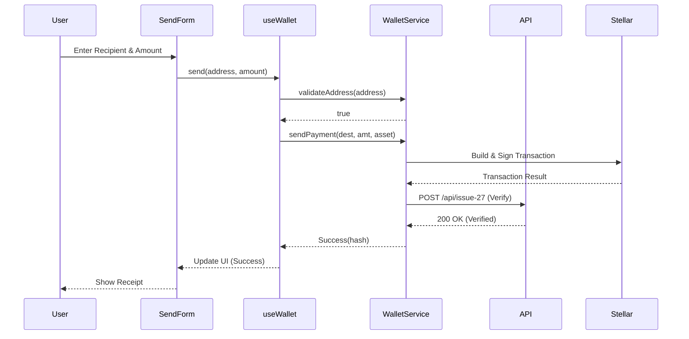
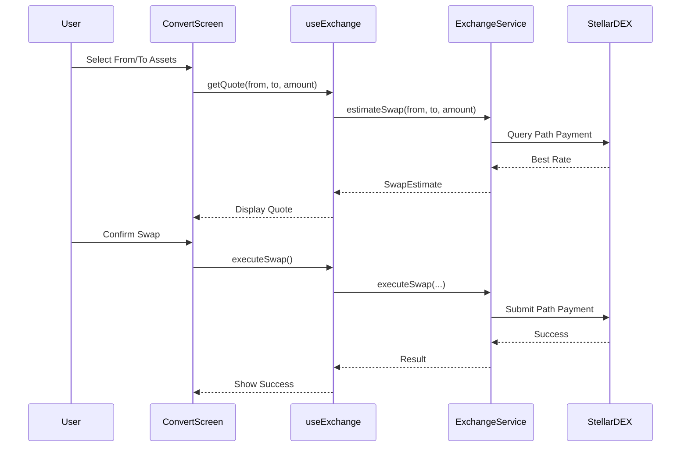

# Globe Wallet Backend & Smart Contract Architecture

## Overview

Globe Wallet is built on a hybrid architecture combining traditional web services with Stellar blockchain integration. This document outlines the complete technical architecture for backend services, smart contracts, and blockchain interactions.

## Architecture Diagram

```
┌─────────────────────────────────────────────────────────────────────────────┐
│                                Frontend                                     │
│  ┌─────────────────┐  ┌─────────────────┐  ┌─────────────────┐            │
│  │   Next.js App   │  │   Wallet UI     │  │   Dashboard     │            │
│  └─────────────────┘  └─────────────────┘  └─────────────────┘            │
└─────────────────┬───────────────┬─────────────────────────────────────────┘
                  │               │
┌─────────────────▼───────────────▼─────────────────────────────────────────┐
│                            API Gateway                                   │
│  ┌─────────────────┐  ┌─────────────────┐  ┌─────────────────┐          │
│  │  Authentication │  │   Rate Limiting  │  │     CORS        │          │
│  └─────────────────┘  └─────────────────┘  └─────────────────┘          │
└─────────────────┬───────────────┬─────────────────────────────────────────┘
                  │               │
┌─────────────────▼───────────────▼─────────────────────────────────────────┐
│                         Backend Services                                 │
│  ┌─────────────────┐  ┌─────────────────┐  ┌─────────────────┐          │
│  │  Wallet Service │  │ Exchange Service │  │ Off-ramp Service │          │
│  └─────────────────┘  └─────────────────┘  └─────────────────┘          │
│  ┌─────────────────┐  ┌─────────────────┐  ┌─────────────────┐          │
│  │   User Service  │  │  Pricing Service │  │ Notification Svc │          │
│  └─────────────────┘  └─────────────────┘  └─────────────────┘          │
└─────────────────┬───────────────┬─────────────────────────────────────────┘
                  │               │
┌─────────────────▼───────────────▼─────────────────────────────────────────┐
│                     Data & Blockchain Layer                              │
│  ┌─────────────────┐  ┌─────────────────┐  ┌─────────────────┐          │
│  │   PostgreSQL    │  │  Stellar Network │  │  Redis Cache    │          │
│  └─────────────────┘  └─────────────────┘  └─────────────────┘          │
│  ┌─────────────────┐  ┌─────────────────┐  ┌─────────────────┐          │
│  │ Banking Partners │  │   Rate Providers │  │   File Storage  │          │
│  └─────────────────┘  └─────────────────┘  └─────────────────┘          │
└─────────────────────────────────────────────────────────────────────────┘
```

## Technology Stack

### Frontend
- **Framework**: Next.js 14 with App Router
- **Language**: TypeScript
- **Styling**: Tailwind CSS + Shadcn/UI
- **State Management**: React Hooks + Context API
- **Wallet Integration**: Stellar SDK for JavaScript

### Backend
- **Runtime**: Node.js 18+ / Bun
- **Framework**: Fastify / Express.js
- **Language**: TypeScript
- **Authentication**: JWT + Passport.js
- **API Documentation**: OpenAPI 3.0 + Swagger

### Database
- **Primary**: PostgreSQL 15+
- **Cache**: Redis 7+
- **Search**: PostgreSQL Full-Text Search
- **Migrations**: Prisma ORM

### Blockchain
- **Network**: Stellar Mainnet/Testnet
- **SDK**: Stellar SDK for JavaScript/TypeScript
- **Wallet**: Freighter, Albedo, WalletConnect
- **Horizon**: Stellar Horizon API

## Core Services Architecture

### 1. Wallet Service

Manages user wallet operations and Stellar blockchain interactions.

```typescript
interface IWalletService {
  getAccountInfo(): StellarAccount
  getBalance(): Promise<Balance[]>
  sendPayment(destination: string, amount: number, asset: AssetCode, memo?: string): Promise<TransactionResult>
  generateReceiveAddress(): string
  validateAddress(address: string): boolean
  getTransactionHistory(): Promise<Transaction[]>
  shortenKey(key: string, lead?: number, tail?: number): string
}

interface StellarAccount {
  publicKey: string
  memo: string
  network: string
}
```

### 2. Exchange Service

Handles currency conversions using Stellar DEX and liquidity pools.

```typescript
interface IExchangeService {
  getCurrentRates(): Promise<Record<AssetCode, number>>
  estimateSwap(from: AssetCode, to: AssetCode, amount: number): Promise<SwapEstimate>
  executeSwap(from: AssetCode, to: AssetCode, amount: number): Promise<TransactionResult>
}

interface SwapEstimate {
  fromAsset: AssetCode
  toAsset: AssetCode
  fromAmount: number
  toAmount: number
  rate: number
  fee: number
}
```

### 3. Off-ramp Service

Manages cryptocurrency to fiat conversions and bank transfers.

```typescript
interface IOffRampService {
  getMethods(): OffRampMethod[]
  initiateWithdrawal(amount: number, asset: AssetCode, methodId: string, targetCurrency: CurrencyCode): Promise<WithdrawalOrder>
  getWithdrawalStatus(orderId: string): Promise<WithdrawalOrder>
  getRates(): Record<CurrencyCode, number>
}

interface WithdrawalOrder {
  id: string
  amount: number
  asset: AssetCode
  payoutAmount: number
  payoutCurrency: CurrencyCode
  status: "pending" | "processing" | "completed" | "failed"
  methodId: string
  createdAt: string
}
```

### 4. Pricing Service

Provides real-time and historical pricing data for all supported assets.

```typescript
interface IPricingService {
  getAssetPrice(code: AssetCode): Promise<number>
  getAssets(): CryptoAsset[]
  formatAsset(amount: number, code: AssetCode, hidden?: boolean): string
}

interface Price {
  asset: string
  currency: string
  price: number
  change24h: number
  volume24h: number
  timestamp: Date
}
```

## Smart Contract Architecture

### Stellar Network Integration

Globe Wallet leverages Stellar's built-in features rather than custom smart contracts:

#### 1. Multi-Signature Accounts
```javascript
// Create multi-sig account for enhanced security
const account = new StellarSdk.Account(publicKey, sequence)
const transaction = new StellarSdk.TransactionBuilder(account, {
  fee: StellarSdk.BASE_FEE,
  networkPassphrase: StellarSdk.Networks.PUBLIC
})
.addOperation(StellarSdk.Operation.setOptions({
  masterWeight: 1,
  lowThreshold: 2,
  medThreshold: 2,
  highThreshold: 2,
  signer: {
    ed25519PublicKey: secondaryKey,
    weight: 1
  }
}))
.setTimeout(30)
.build()
```

#### 2. Automated Market Making
```javascript
// Create liquidity pool for XLM/USDC
const poolOperation = StellarSdk.Operation.liquidityPoolDeposit({
  liquidityPoolId: poolId,
  maxAmountA: xlmAmount,
  maxAmountB: usdcAmount,
  minPrice: minPrice,
  maxPrice: maxPrice
})
```

#### 3. Path Payment Operations
```javascript
// Multi-currency payment routing
const pathPayment = StellarSdk.Operation.pathPaymentStrictSend({
  sendAsset: sourceAsset,
  sendAmount: sendAmount,
  destination: destinationKey,
  destAsset: destAsset,
  destMin: minDestAmount,
  path: [intermediateAsset1, intermediateAsset2]
})
```

### Soroban Smart Contract Layer

The frontend interacts with Soroban smart contracts via `ISorobanService`.
Contract interface specifications are maintained in `contracts/soroban-spec.json`
and validated in CI against the source of truth in the `Orbit-Wal/contract` repository.

#### GlobeWallet Contract

The `globe-wallet` contract ([source](https://github.com/Orbit-Wal/contract/blob/main/contracts/globe-wallet/src/lib.rs))
provides:

- **Asset registry**: `add_asset`, `remove_asset`, `get_assets` — whitelist up to 50 assets per user
- **Spend limits**: `set_spend_limit`, `get_spend_limit`, `record_spend` — per-asset daily caps enforced on-chain
- **Admin governance**: `initialize`, `admin`, `propose_admin`, `accept_admin`, `cancel_admin_transfer`
- **Upgrade safety**: `propose_upgrade`, `execute_upgrade` — timelocked WASM upgrades
- **Social recovery**: guardian-based M-of-N admin recovery (see contract docs for details)

The `ISorobanService` interface in `lib/types.ts` mirrors the contract's public
functions. The mock implementation (`soroban.service.mock.ts`) is used for
development; the live implementation (`soroban.service.ts`) connects via
`@stellar/stellar-sdk` `SorobanRpc.Server`.

#### TokenWrapper Contract

The `token-wrapper` contract implements token approval and transfer-from
patterns. Its implementation is currently missing from the upstream contract
repository. See [docs/soroban-gap.md](./soroban-gap.md) for details.

#### Synchronization

CI validates `contracts/soroban-spec.json` against the contract source via
`scripts/check-soroban-sync.mjs`. This prevents silent interface drift between
the frontend and the contract repository.

## Database Schema

### User Management
```sql
-- Users table
CREATE TABLE users (
    id UUID PRIMARY KEY DEFAULT gen_random_uuid(),
    email VARCHAR(255) UNIQUE NOT NULL,
    password_hash VARCHAR(255) NOT NULL,
    kyc_status VARCHAR(50) DEFAULT 'pending',
    created_at TIMESTAMP DEFAULT NOW(),
    updated_at TIMESTAMP DEFAULT NOW()
);

-- Wallet accounts
CREATE TABLE wallet_accounts (
    id UUID PRIMARY KEY DEFAULT gen_random_uuid(),
    user_id UUID REFERENCES users(id),
    public_key VARCHAR(56) UNIQUE NOT NULL,
    encrypted_private_key TEXT NOT NULL,
    account_type VARCHAR(50) DEFAULT 'standard',
    is_active BOOLEAN DEFAULT true,
    created_at TIMESTAMP DEFAULT NOW()
);
```

### Transaction Management
```sql
-- Transactions
CREATE TABLE transactions (
    id UUID PRIMARY KEY DEFAULT gen_random_uuid(),
    user_id UUID REFERENCES users(id),
    stellar_hash VARCHAR(64) UNIQUE,
    type VARCHAR(50) NOT NULL, -- send, receive, convert, withdraw
    from_asset VARCHAR(20),
    to_asset VARCHAR(20),
    amount DECIMAL(20,7),
    fee DECIMAL(20,7),
    status VARCHAR(50) DEFAULT 'pending',
    created_at TIMESTAMP DEFAULT NOW(),
    confirmed_at TIMESTAMP
);

-- Off-ramp orders
CREATE TABLE withdrawal_orders (
    id UUID PRIMARY KEY DEFAULT gen_random_uuid(),
    user_id UUID REFERENCES users(id),
    amount DECIMAL(20,2),
    asset VARCHAR(20),
    payment_method_id UUID,
    status VARCHAR(50) DEFAULT 'pending',
    processing_fee DECIMAL(20,2),
    external_reference VARCHAR(255),
    created_at TIMESTAMP DEFAULT NOW(),
    completed_at TIMESTAMP
);
```

## API Endpoints

### Wallet Endpoints
```typescript
// Wallet management
GET    /api/v1/wallet/balance
POST   /api/v1/wallet/send
GET    /api/v1/wallet/receive/:address
GET    /api/v1/wallet/transactions
POST   /api/v1/wallet/import

// QR Code generation
GET    /api/v1/wallet/qr/:address
POST   /api/v1/wallet/qr/payment-request
```

### Exchange Endpoints
```typescript
// Exchange operations
GET    /api/v1/exchange/rates
POST   /api/v1/exchange/swap/estimate
POST   /api/v1/exchange/swap/execute
GET    /api/v1/exchange/order-book/:pair
GET    /api/v1/exchange/history/:pair
```

### Off-ramp Endpoints
```typescript
// Off-ramp operations
GET    /api/v1/off-ramp/methods
POST   /api/v1/off-ramp/methods
POST   /api/v1/off-ramp/withdraw
GET    /api/v1/off-ramp/orders
GET    /api/v1/off-ramp/orders/:id/status
```

## Security Architecture

### Authentication & Authorization
- JWT-based authentication with refresh tokens
- Role-based access control (RBAC)
- Multi-factor authentication (MFA) support
- API rate limiting and DDoS protection

### Wallet Security
- Client-side private key encryption
- Hardware wallet integration (Ledger, Trezor)
- Multi-signature transaction signing
- Secure enclave storage on mobile

### Data Protection
- End-to-end encryption for sensitive data
- PII encryption at rest
- Secure key management (AWS KMS/HashiCorp Vault)
- Regular security audits and penetration testing

### Compliance
- KYC/AML integration with third-party providers
- Transaction monitoring and reporting
- GDPR compliance for EU users
- SOC 2 Type II certification

## Deployment Architecture

### Infrastructure
- **Cloud Provider**: AWS/GCP/Azure
- **Container Orchestration**: Kubernetes
- **Service Mesh**: Istio
- **Load Balancer**: AWS ALB/NGINX
- **CDN**: CloudFlare/AWS CloudFront

### Monitoring & Observability
- **Metrics**: Prometheus + Grafana
- **Logging**: ELK Stack (Elasticsearch, Logstash, Kibana)
- **Tracing**: Jaeger/DataDog APM
- **Alerts**: PagerDuty/Slack integration

### CI/CD Pipeline
- **Version Control**: GitHub/GitLab
- **CI/CD**: GitHub Actions/GitLab CI
- **Container Registry**: Docker Hub/ECR
- **Deployment**: ArgoCD/Flux

## Performance Considerations

### Scalability
- Horizontal pod autoscaling based on CPU/memory
- Database connection pooling
- Redis caching for frequently accessed data
- CDN for static assets and API responses

### Optimization
- Database query optimization with indexes
- Stellar Horizon API connection pooling
- Background job processing with queues
- Lazy loading for frontend components

## Disaster Recovery

### Backup Strategy
- Automated database backups (daily/hourly)
- Cross-region backup replication
- Point-in-time recovery capability
- Stellar account backup and recovery procedures

### High Availability
- Multi-AZ database deployment
- Redundant service instances
- Circuit breakers for external API calls
- Graceful degradation of non-critical features

## Testing Strategy

### Unit Testing
- Jest for JavaScript/TypeScript
- Service layer test coverage > 90%
- Stellar SDK transaction testing

### Integration Testing
- API endpoint testing with Supertest
- Database integration tests
- Stellar testnet integration

### End-to-End Testing
- Playwright for browser automation
- Critical user journey testing
- Cross-browser compatibility testing

### Security Testing
- OWASP ZAP for vulnerability scanning
- Stellar transaction security testing
- Penetration testing (quarterly)

## Future Enhancements

### Phase 2 Features
- DeFi yield farming integration
- NFT marketplace integration
- Cross-chain bridge support
- Advanced analytics dashboard

### Phase 3 Features
- Mobile app development (React Native)
- Institutional trading features
- White-label solutions
- Regulatory compliance automation

### Sequence Diagrams

#### Payment Flow (Send)


#### Asset Exchange Flow (Swap)


---

This architecture document serves as the foundation for Globe Wallet's technical implementation. All services are designed to be modular, scalable, and secure, following industry best practices for cryptocurrency wallet applications.